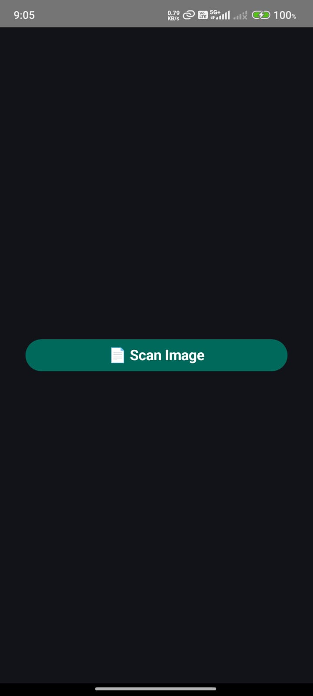
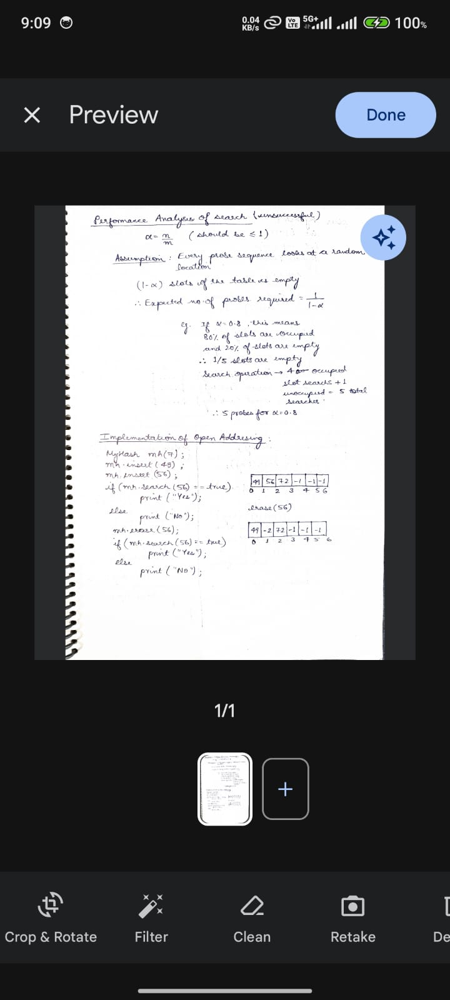
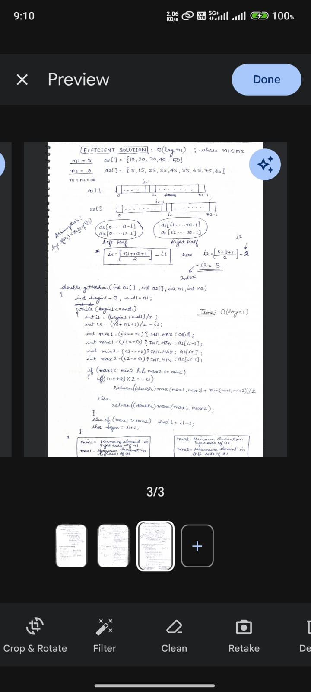
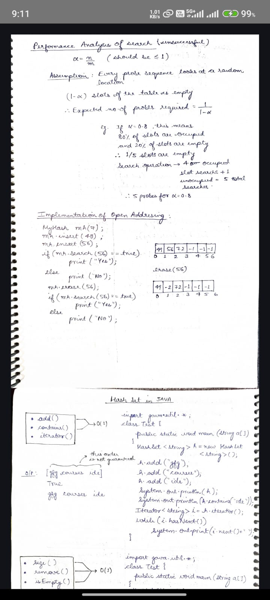

# 📄 Document Scanner App

An Android app built with **Jetpack Compose** and **Google ML Kit Document Scanner API** that lets users scan documents as JPEG or PDF, view them instantly, and save PDFs locally.

[](https://kotlinlang.org/)
[](https://developer.android.com/jetpack/compose)

---

## 🚀 Features

- 📸 Scan documents using camera or import from gallery  
- 🖼️ View scanned pages in-app using **Coil** image loader  
- 📄 Save scanned documents as PDF to local storage  
- 🎨 Modern UI built with Jetpack Compose  
- 🔘 Custom "Scan Image" button with improved style and accessibility

---

## 📷 Screenshots

<div style="display: flex; flex-wrap: wrap; justify-content: center; gap: 20px;">

  
  
  

  
  
  
  
  

</div>

---

## 🛠️  Tech Stack

- **Kotlin**
- **Jetpack Compose**
- **ML Kit Document Scanner (GMS)**
- **Coil (Image loading)**

---

## 📦 Getting Started

Follow these steps to get a local copy up and running:

1. Clone the repository:
   ```bash
   https://github.com/adarshabhishek/Document-Scanner-App.git
